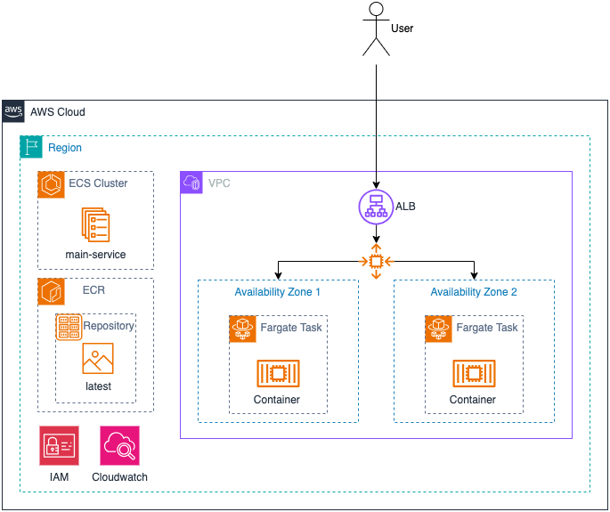

# ALB and ECS

## Architecture

## Assumptions
* AWS CLI is installed
* Terraform AWS provider:
  * The `default` AWS configuration profile is used
  * AWS Region is `us-west-2`
* The solution will use the default VPC and sub-nets.

## Setup

### ECR
1. Step into the `ecr` folder
2. Deploy infrastructure
   1. `terraform init`
   2. `terraform plan`
   3. `terraform apply --auto-approve`
2. Navigate to ECR in the AWS Console - https://us-west-2.console.aws.amazon.com/ecr/private-registry/repositories?region=us-west-2
   1. Select the `ecs-primary` Repository
   2. Click `View push commands` button
   3. Complete the steps to build/tag/push to the ECR repository.
3. Authenticate Docker client
   1. `aws ecr get-login-password --region us-west-2 | docker login --username AWS --password-stdin AWS_ACCOUNT.dkr.ecr.us-west-2.amazonaws.com`
4. Build the Docker image:
   1. `docker build -t ecs-primary .`
5. Tag Docker image for push to ECR
   1. `docker tag ecs-primary:latest AWS_ACCOUNT.dkr.ecr.us-west-2.amazonaws.com/ecs-primary:latest` 
6. Push to ECR
   1. `docker push AWS_ACCOUNT.dkr.ecr.us-west-2.amazonaws.com/ecs-primary:latest`
7. Confirm the image exists in the 

### ECS
1. Step into the `ecs-service-web` folder
2. Update Task definition
   1. Navigate to `task-definition.json`
   2. Update the `"image"` value to `AWS_ACCOUNT.dkr.ecr.us-west-2.amazonaws.com/ecs-primary:latest`
3. Update ALB ingress whitelist IP
   1. Navigate to `vars.tf`
   2. Update the `default` value for `whitelist_cidr_block`
      1. Your IP - `YOUR.IP.GOES.HERE/32`
      2. Public -  `0.0.0.0/0`
3. Deploy infrastructure
   1. `terraform init`
   2. `terraform plan`
   3. `terraform apply --auto-approve`
4. Copy Outputs value for `alb_dns`

### Validate

1. Paste the `alb_dns` value into a browser and enjoy!

### Clean Up

1. Step into the `ecs-service-web` folder
2. Destroy infrastructure
   1. `terraform destroy --auto-approve`
3. Step into the `ecr` folder
4. Destroy infrastructure
   1. Navigate to ECR in the AWS Console
   2. Click the `ecs-primary` repository
   2. Delete the `latest` image
      1. This is required, otherwise a `RepositoryNotEmptyException:` is returned by Terraform
   3. `terraform destroy --auto-approve`